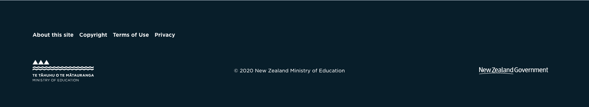

# Ministry of Education Standard Footer.

This repository contains all the source code for the standard Ministry of 
Education footer to avoid the need to rebuild the same markup and functionality
between all the sites.

Authors can remove logos and update all the copy on the text.

Version 1:



Version 2:

<Insert Image>

## Usage

In your template use the include as follows

```
<% include Education\Standards\Footer %>
```

Your SCSS will also need to include the styles

```
@import "../../vendor/education/standard-footer/client/scss/footer.scss"
```

Then you'll be good to go. You can customize any of the colours, logos as you se fit.

## Configuration

The footer has several parts to be created and managed in the CMS as per the 
image above.

 - Upper Social Links (top left)
 - Upper Links (featured buttons top right)
 - Lower Links

If you want, you can opt for a compressed version (i.e disabling the top links)
by using the following configuration option

```
Education\StandardFooter\Model\EducationFooterLink:
  top_links_enabled: false
```


